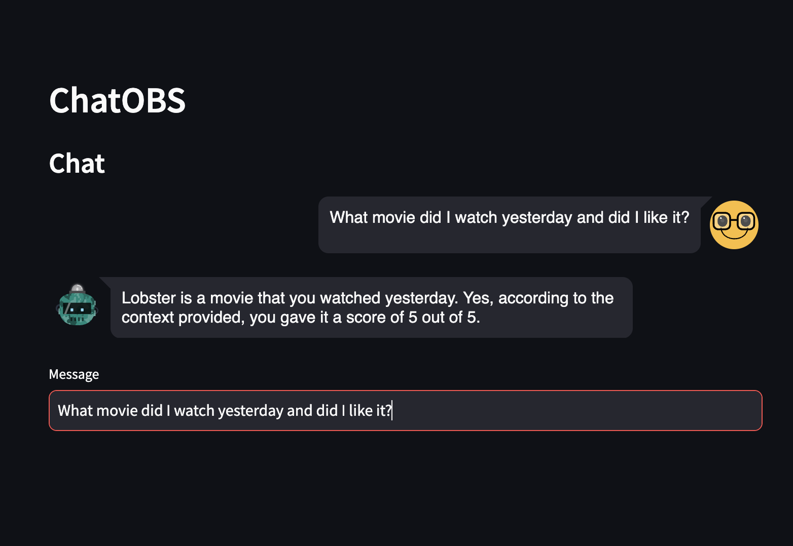

# Chat with Obsidian Docs using Streamlit

## Description
I built this app to converse with my obsidian notes because I fortet what I take a note off. Basically, this app allows you to chat with your Obsidian docs using a Streamlit UI. You can send messages, receive responses, and interact with your Obsidian documents in a conversational manner.

## Installation
To install the app, follow these steps:
1. Clone the repository from GitHub.
2. Put your obsidian vault in the wrkdir
3. Install the necessary dependencies using `poetry install`.
4. Run the app using the command `streamlit run main_app.py`.

## Usage
Once the app is running, open the chat interface and start typing your messages. The app will interact with your Obsidian docs based on the commands and queries you provide.

## To DO
1. add pdf upload to store in obsidian as extra info

## Features
- Streamlit UI for interacting with Obsidian docs
- Send and receive messages
- Conversational interaction with documents

## Contributing
If you'd like to contribute to the development of this app, please follow the guidelines in CONTRIBUTING.md.

## License
no license, use at your own risk
